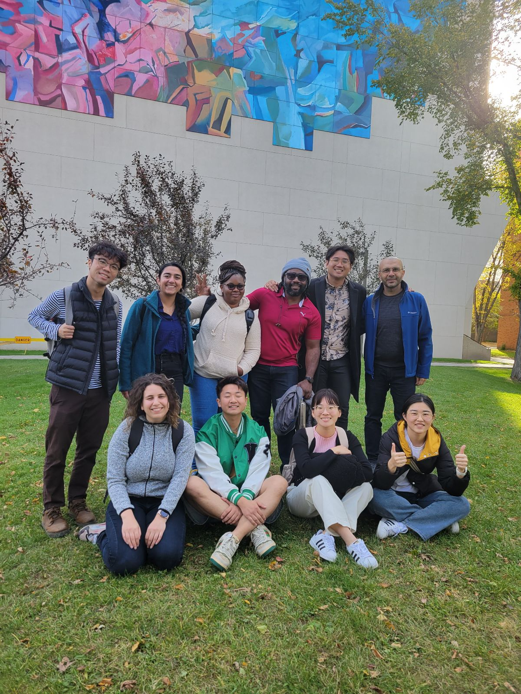

```{r setup, include=FALSE}
knitr::opts_chunk$set(echo = FALSE)
```

[**GO BACK TO ALL POSTS**](https://okanbulut.github.io/meds/)


🍁📚 Welcome, Fall 2023 Students! 📚🍁

As the leaves outside begin their enchanting transformation, we are delighted to extend a warm and heartfelt welcome to each and every one of our students as they embark on their academic journey at the University of Alberta. 

This Fall, our campus comes alive with the promise of new friendships, inspiring professors, and countless opportunities for personal and intellectual development. Together, we will explore uncharted territories of learning, delve into the depths of curiosity, and embrace the challenges that will shape your future. 

To celebrate the beginning of this exciting semester, the [Measurement, Evaluation, and Data Science (MEDS)](https://sites.google.com/ualberta.ca/meds) program organized a delightful gathering for all graduate students at the charming [Rosso Pizzeria](https://www.rossopizzeria.ca/). This was the perfect opportunity to bring our students together, relax after the first week of classes, and share some delicious food and laughter together.



On behalf of the entire U of A family, we wish all students a spectacular academic year filled with achievements, unforgettable moments, and discoveries. Together, we'll create a tapestry of memories that will color your life for years to come. 

Here's to a successful and transformative academic year ahead! 🌟📖🎓

Warmest regards,

Okan Bulut  
Associate Professor  
University of Alberta  

