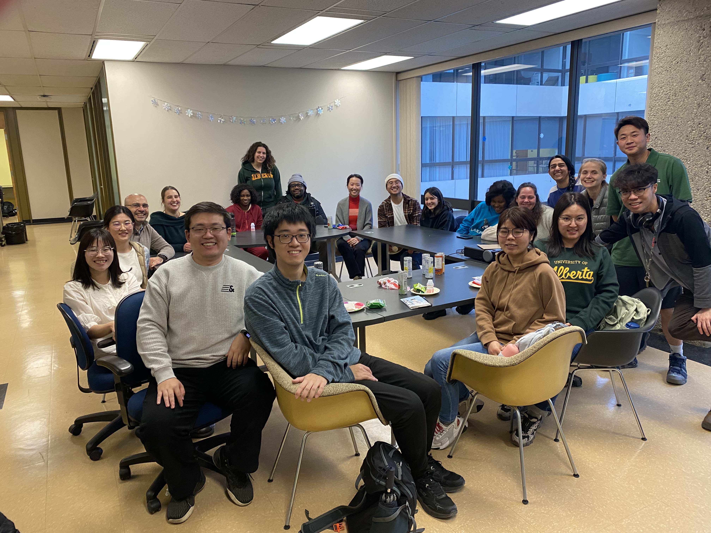

```{r setup, include=FALSE}
knitr::opts_chunk$set(echo = FALSE)
```

[**GO BACK TO ALL POSTS**](https://okanbulut.github.io/meds/)


# 🍁A Festive End-of-Year Gathering🍁

As the Fall semester comes to a close, the [Measurement, Evaluation, and Data Science (MEDS)](https://sites.google.com/ualberta.ca/meds) program recently hosted a joyous end-of-year celebration that brought together graduate students and faculty members. The event was a testament to the hard work, dedication, and numerous achievements of the MEDS community over the past months.





**A Year of Success for MEDS Students**

One of the highlights of the celebration was reflecting on the impressive accomplishments of MEDS students. A notable achievement is the acceptance of a significant number of conference presentations for various conferences, with the pinnacle being the annual meeting of the National Council on Measurement in Education (NCME) scheduled to take place in Philadelphia, PA in April 2024. This accomplishment not only showcases the students' commitment to advancing their field but also underscores the academic excellence fostered within the MEDS program.

The meeting was also a great opportunity for the Beijing Normal Cohort to share their first-term experiences at the University of Alberta. The cross-cultural exchange enriched the gathering, providing a unique perspective on the diverse learning environment at MEDS.

**Celebrating Excellence** 

In a moment of pride for the MEDS program, we extend heartfelt congratulations to two outstanding students, Bin Tan and Surina He, for receiving the [Alberta Graduate Excellence Scholarship (AGES)](https://www.ualberta.ca/graduate-studies/awards-and-funding/scholarships/ages.html). This prestigious scholarship recognizes and rewards exceptional academic achievement in graduate studies in Alberta, including international students. Bin Tan and Surina He's achievement is a testament to their dedication and scholarly contributions, making MEDS proud to have such accomplished individuals in the program.

The AGES serves as an incentive to attract the best and brightest minds, fostering a culture of excellence within the academic community. The fact that two international students from the MEDS program have been honored with this esteemed award further underscores the global impact and recognition of the program.

**Wishing Everyone Happy Holidays**

As we approach the holiday season, the MEDS program would like to extend warm wishes to all students and faculty members. May this festive season be filled with joy, relaxation, and moments of reflection on the accomplishments of the past year. We look forward to the opportunities and challenges the new year will bring and are excited to continue our journey of learning and discovery together.

Cheers to a successful year and a promising future for the Measurement, Evaluation, and Data Science program at the University of Alberta! Happy holidays to all!

Warmest regards,

Okan Bulut  
Associate Professor  
University of Alberta


