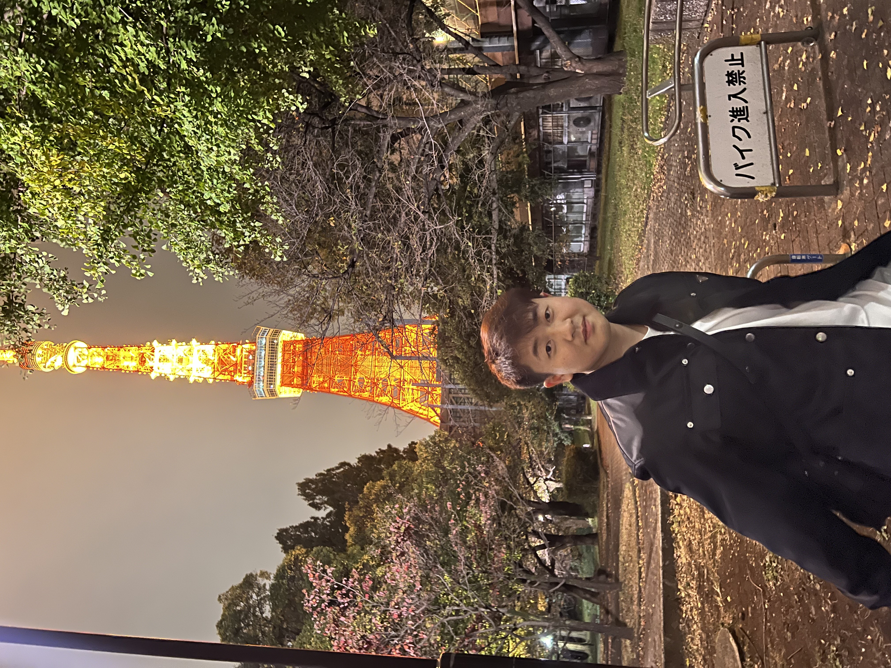
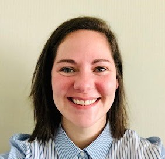
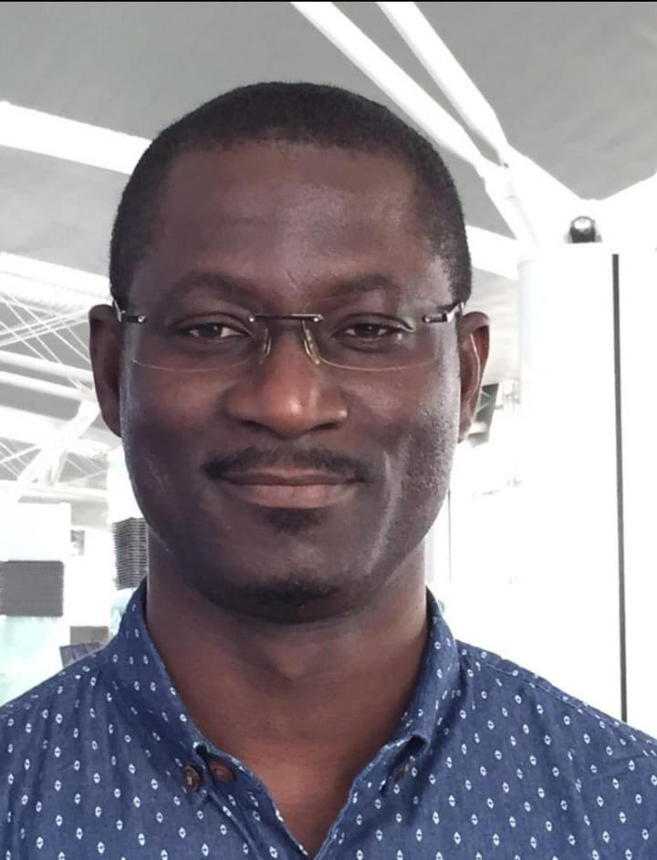

```{r setup, include=FALSE}
knitr::opts_chunk$set(echo = FALSE)
```

[**GO BACK TO ALL POSTS**](https://okanbulut.github.io/meds/)


# ✨Awards for  MEDS Students✨

In a remarkable display of academic excellence, our distinguished MEDS graduate students have recently garnered a series of prestigious awards and scholarships. These accolades not only underscore their commitment to scholarly pursuits but also highlight their exceptional contributions to the academic community. Join us in celebrating the well-deserved recognition bestowed upon our accomplished MEDS graduate students, as they continue to exemplify the highest standards of achievement within our institution.

Best regards,

Okan Bulut  
Associate Professor  
University of Alberta

<br /> 
<br /> 


**Surina He (Doctoral Student)** 

* [Alberta Innovates Graduate Student Scholarship](https://www.ualberta.ca/graduate-studies/awards-and-funding/scholarships/ab-innovates/ai-graduate-student-scholarship.html) 2023/2024

  * **Project title:** Enhanced assessment of collaborative problem-solving ability using machine learning technique

* [Alberta Graduate Excellence Scholarship](https://www.ualberta.ca/graduate-studies/awards-and-funding/scholarships/ages.html) 2023/2024

  * **Project title:** Examining pre-school children’s problem-solving strategies using process data

***


**Bin Tan (Doctoral Student)**

* [Alberta Graduate Excellence Scholarship](https://www.ualberta.ca/graduate-studies/awards-and-funding/scholarships/ages.html) 2023/2024

  * **Project title:** Assessing the value of examinees’ response time profiles
  

***


**Ashley Clelland (Doctoral Student)** 

* [Accessible Teaching, Learning, and Assessment Systems (ATLAS) Fellowship](https://atlas.ku.edu/research_fellowship) 2023/2024

  * **Project title:** A systematic review of online professional development in special education


***


**Augustine Botwe (Doctoral Student)**

* [Graduate Student Engagement Scholarship](https://www.ualberta.ca/graduate-studies/awards-and-funding/scholarships/graduate-student-engagement-scholarship.html) 2023/2024

***


**Doris Abroampah (MEd Student)**

* [Graduate Student Engagement Scholarship](https://www.ualberta.ca/graduate-studies/awards-and-funding/scholarships/graduate-student-engagement-scholarship.html) 2023/2024

