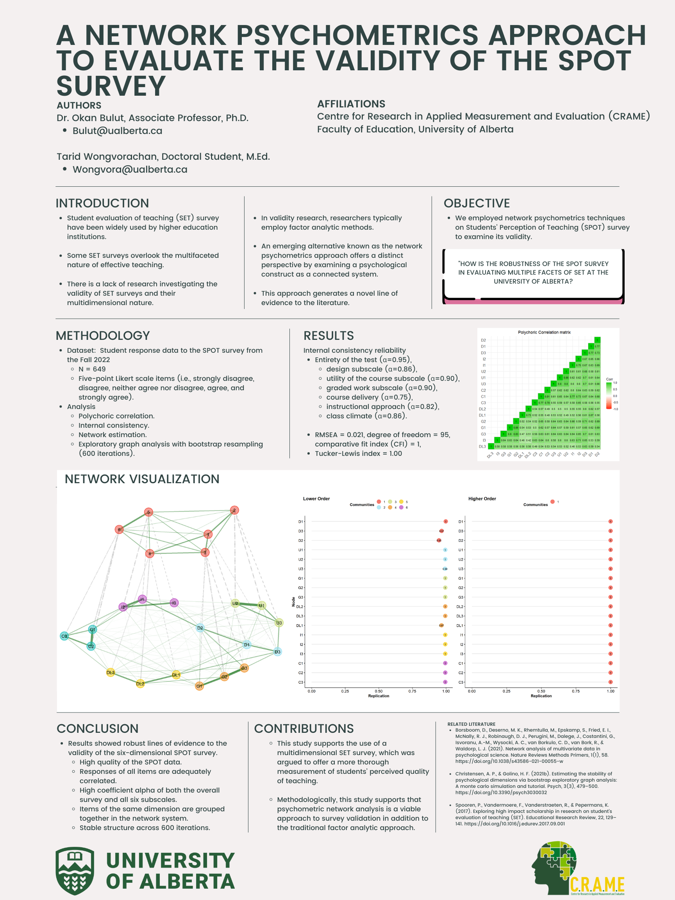
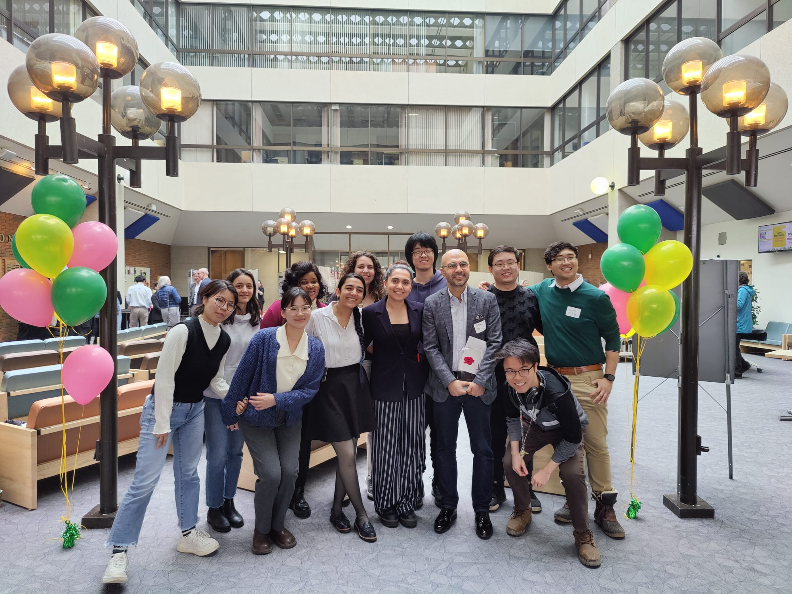

```{r setup, include=FALSE}
knitr::opts_chunk$set(echo = FALSE)
```

[**GO BACK TO ALL POSTS**](https://okanbulut.github.io/meds/)


# MEDS Faculty and Students at the Faculty of Education Research Event

[The Faculty of Education](https://www.ualberta.ca/education/index.html) recently organized a research event, *Celebrating Socially Transformative Research and Teaching 2024*, to showcase the breadth and depth of research conducted by faculty members and students. The event, the first in-person showcase of Faculty-wide research and teaching excellence of the 2020s, took place on Thursday, March 28 in the 4th floor lounge of Education Centre North. 

More than 60 poster presentations spanning every program area, institute and centre in the Faculty, as well as three live presentations, attested to the sweeping depth and breadth of research taking place here, and demonstrated that socially transformative research and teaching is no mere catchphrase but a promise made good by incredible scholars and students in the Faculty of Education. The attendees, including President Bill Flanagan and Provost Verna Yiu, had the opportunity to participate in wonderful conversations and festive atmosphere enabled by the event.

MEDS faculty members (Drs. Okan Bulut and Mark Gierl) and graduate students also attended the event and presented their research. Also. Dr. Okan Bulut was recognized as the recipient of the Martha Cook Piper Research Prize at the University of Alberta. We are happy to share some photos from the event, as well as the wonderful posters presented by our gradute students. 

Best regards,

Okan Bulut  
Associate Professor  
University of Alberta

***








